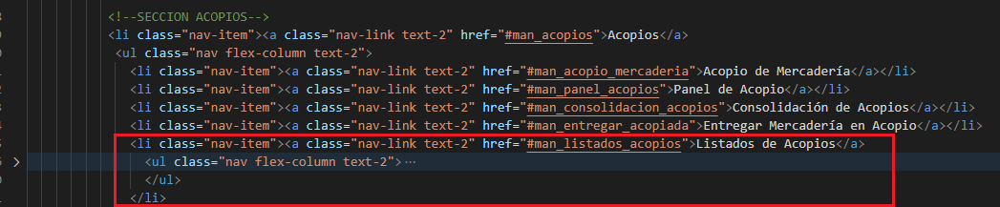
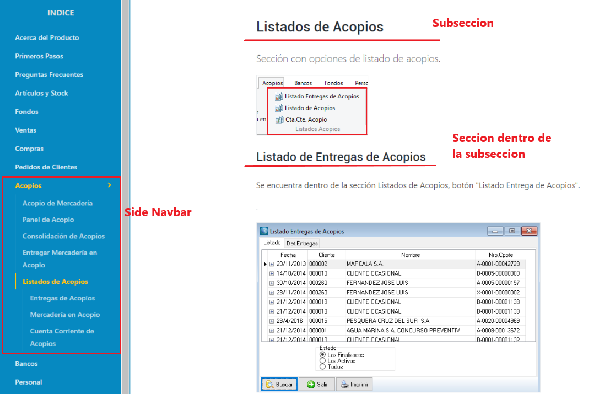

# Documentacion

Este manual de usuario fue adaptado a partir de una plantilla que utiliza las tecnologias HTML, CSS y Bootstrap, más información debajo. A continuacion se describe una forma sencilla de agregar contenido a este manual.

## Como agregar secciones
<ol>
  <li>
    Agregamos una etiqueta "section" dentro de la parte del documento index.html donde queremos que se vea la nueva seccion. Le asignamos un "id" con el nombre que queremos que tenga (no debe pisarse con otro id que ya exista). 
    
</img>

  </li>
  <li>
    Agregamos el contenido dentro de etiquetas "h2" o "h3" para los titulos, y "p" para los parrafos.  
    
</img>

  </li>
  <li>
    Agregamos imagenes utilizando la etiqueta "img" dentro de una etiqueta "p" para que no quede muy pegada a los textos. Esta imagen debe estar almacenada en 
    la carpeta "assets/images" dentro del proyecto (recomendacion: guardar dentro de una subcarpeta relacionada a la seccion). En la etiqueta "img" agregamos la propiedad "src" que indica donde esta almacenada la imagen, el Visual Studio Code nos ayuda en la busqueda.  
    
</img>

    Para agregar imagenes que se agranden al hacer click (pop-up), podemos englobar la etiqueta "img" con una etiqueta "a", que tenga la propiedad "class" con el valor "popup-img". Esta etiqueta tambien debe tener la popiedad "src" con una imagen, que puede ser la misma que utilizamos en "img" o, por ejemplo, una versión más achicada.  
    
</img>

  </li>
  <li>
    Finalmente, agregamos la seccion dentro del Navbar lateral, para que el usuario pueda ir directamente a ella. Para ello, nos dirijimos a la seccion "Sidebar Navigation" dentro del documento html:  
      
</img>

    Luego, agregamos un nuevo item a la seccion. Existen tres formas de hacerlo, dependiendo del tipo de seccion que queremos crear. Si estamos agregando una seccion relacionada a una solapa entera del sistema (por ej, Ventas, Compras, Fondos, etc.), agregamos la seccion al mismo nivel que el resto de las solapas. Creamos una etiqueta "li" con la propiedad "class" y el valor "nav-item", y dentro de ella creamos una etiqueta "a" con la clase "nav-link". Esta debe tener la etiqueta "href" con el valor igual al id de la etiqueta "section" que creamos en el punto 1, con un # al principio. Finalmente, agregamos una etiqueta "ul" con la clase "nav flex-column" donde iran las subsecciones de esta solapa.   
      
</img>

    Si queremos agregar una subseccion, realizamos los mismos pasos que en el caso anterior agregando la etiqueta "li" dentro de la etiqueta "ul":  
      
</img>

    Por ultimo, podemos agregar una seccion dentro de esta subseccion creando una etiqueta "ul" como la anterior:  
      
</img>

    Y agregando items de la misma forma:  
      
</img>

  </li>
</ol>

## Resultado

</img>

# Documentacion de iDocs

## Overview:
<a href="https://harnishdesign.net/idocs-free-one-page-documentation-html-template.html">Template Overview Page</a>

## Demo:
Click this link for a live demo : <a href="https://harnishdesign.net/demo/html/idocs/demos.html">View a Demo here</a>

## How to Use:
You can read details documentation here - <a href="https://harnishdesign.net/demo/html/idocs/help/">View Documentation Here</a>

## Bugs and Issues
Have an issue with this template? <a href="https://github.com/harnishdesign/iDocs/issues">Open a new issue here</a>

OR Leave a comment on the <a href="https://harnishdesign.net/idocs-free-one-page-documentation-html-template.html">Template Overview Page at Harnish Design</a> for general inquiry.

## Credits:
<ul>
<li><a href="https://getbootstrap.com/">Bootstrap 4</a></li>
<li><a href="http://www.jquery.com/">jQuery</a></li>
<li><a href="http://gsgd.co.uk/sandbox/jquery/easing/">jQuery easing</a></li>
<li><a href="http://dimsemenov.com/plugins/magnific-popup/">Magnific Popup</a></li>
<li><a href="https://fontawesome.com/">Font Awesome</a></li>
<li><a href="https://highlightjs.org/">Highlight Js</a></li>
<li><a href="https://unsplash.com/">Unsplash</a></li>
</ul>

## Created By:
<a href="https://www.harnishdesign.net/">Harnish Design</a>

## Donations & Support
My Brain needs two urgent coffees to continue working. Buy one or two coffees for me here: https://opencollective.com/idocs

## License:
See the <a href="https://github.com/harnishdesign/iDocs/blob/main/LICENSE">LICENSE</a> file for license rights and limitations (MIT).
